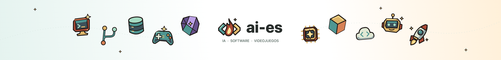

<p align="center">
  
</p>

<h1 align="center">ai-es</h1>
<p align="center"><strong>Código, juegos y cosas que vamos probando.</strong></p>
<p align="center">
  <a href="https://ai-es.dev">La web</a> ·
  <a href="https://discord.gg/U9F4b9avV5">Discord</a> ·
  <a href="https://www.reddit.com/r/ai_es/">Reddit</a> ·
  <a href="https://ai-es.dev/feed.xml">RSS</a>
</p>
<p align="center">
  <a href="https://github.com/jvidalv/ai-es/actions/workflows/ci.yml"></a>
</p>

Comunidad en español para hablar de IA, desarrollo de software y videojuegos. Gente de España y Latinoamérica compartiendo lo que va probando.

- Web: https://ai-es.dev
- Discord: https://discord.gg/U9F4b9avV5
- Reddit: https://www.reddit.com/r/ai_es/

## Desarrollo

Node 24, React, TypeScript estricto y Vite+ 1.0. El gestor del proyecto es npm, gestionado por Vite+.

```sh
vp install
vp run hooks:install
vp dev
```

La web se abre en `http://localhost:5173`. Los cambios en `content/posts/` se regeneran durante el desarrollo. No editar `src/generated/`.

```sh
vp run check:push-gates
vp run build
vp run start
```

Usar **`vp run build`**, no solo `vp build`: el script completo valida tipos, compila el cliente y genera HTML, Markdown, sitemap y feeds. Producción sirve `dist/` en el puerto `PORT` (3000 por defecto). No requiere base de datos, secretos ni CMS.

## Publicar un artículo o una noticia

Crear un archivo en `content/posts/mi-articulo.md`. El nombre en kebab-case será la URL. Puede hacerse directamente desde GitHub. Leer antes [la guía de escritura](docs/writing-style.md): conversación entre iguales, español cercano y sin tono comercial.

```md
---
title: "Lo que aprendí haciendo mi primer prototipo"
description: "Una descripción concreta del artículo para la lista y los buscadores."
date: "2026-10-01"
kind: articulo
topic: desarrollo
icon: "08"
author: "Tu nombre"
draft: true
---

El texto va aquí, en Markdown.

## Un apartado

También hay listas, enlaces, citas y bloques de código.
```

- `kind`: `articulo` o `noticia`.
- `topic`: `ia`, `desarrollo` o `videojuegos`.
- `icon`: `03` robot, `04` comunidad, `05` mando, `06` bombilla, `07` cohete, `08` ordenador.
- `featured: true` destaca un artículo en el inicio.
- `draft: true` excluye la publicación de **todos** los resultados públicos, incluidas las versiones para LLMs.
- Una fecha futura también la excluye. Para publicarla hay que ejecutar un nuevo build a partir de esa fecha; no existe un programador automático.
- Cambiar `draft` a `false` o eliminarlo y hacer merge a `main` publica la entrada cuando Railway termina el despliegue.
- El título, la descripción, la fecha y los vídeos incrustados se validan. Un error bloquea el build.

## Imágenes

Subir las imágenes a `public/images/posts/` y referenciarlas con una ruta que empiece por `/images/`. Escribir siempre un texto alternativo que describa la información de la imagen.

```md

```

También se admiten imágenes HTTPS externas. Preferir archivos propios optimizados en WebP/AVIF para evitar depender de otros servidores. No subir capturas con datos privados. Las ilustraciones originales de ai-es están en `public/images/`.

## YouTube dentro de cualquier publicación

Escribir esta directiva en su propio párrafo, separada por líneas en blanco:

```md
::youtube[Fundamentos del multijugador en Godot](https://www.youtube.com/watch?v=tK2ACXUGcrY)
```

Se muestra un reproductor que se activa al pulsar. Antes de ese clic no se descarga contenido de YouTube. El iframe utiliza `youtube-nocookie.com`, tiene título accesible y permite pantalla completa. Los enlaces `youtu.be`, `/watch`, `/shorts/` y `/embed/` se validan por host e identificador. Dentro de un bloque de código, la directiva se muestra como texto.

Los vídeos van dentro de los artículos; no hay una sección de vídeos independiente. Atribuir cada recurso y explicar qué ofrece, sin presentar vídeos externos como propios.

## SEO y acceso desde LLMs

Todas las rutas tienen HTML completo antes de ejecutar JavaScript. Cada página tiene título, descripción, URL canónica, metadatos Open Graph y datos estructurados. Los artículos incluyen fecha, autor y su ilustración. Hay páginas por tema y enlaces internos. Las rutas inexistentes devuelven **HTTP 404**, no una SPA con estado 200.

El build genera desde las mismas publicaciones visibles:

- `/sitemap.xml` y `/robots.txt`.
- `/feed.xml`, para lectores RSS.
- `/llms.txt`, índice breve en Markdown.
- `/llms-full.txt`, copia completa del contenido público.
- `index.md` junto a cada página, con su fuente canónica y enlaces absolutos. El HTML anuncia esta alternativa con `rel="alternate"` y `type="text/markdown"`.

No se bloquean rastreadores en robots.txt. `llms.txt` es una convención complementaria, no una garantía de indexación o aparición en respuestas. No se inventan fechas de actualización ni valoraciones para obtener resultados enriquecidos. Mantener las URLs al editar títulos; si se cambia un slug, añadir una redirección permanente.

Después de conectar el dominio, verificarlo en Google Search Console y Bing Webmaster Tools y enviar `https://ai-es.dev/sitemap.xml`. Esto necesita acceso a las cuentas del propietario. Revisar el tráfico real antes de añadir analítica; actualmente no se instala seguimiento.

## Railway y Cloudflare

Railway construye el Dockerfile y ejecuta `node server.ts`. La imagen final solo contiene el servidor y la salida estática, corre como usuario sin privilegios y escucha en `0.0.0.0:$PORT`. El health check es `/`.

En Railway, conectar el servicio `web` al repositorio `jvidalv/ai-es`, rama `main`. La conexión de GitHub permite desplegar cambios de contenido automáticamente. Si Railway no tiene acceso al nuevo repositorio, autorizarlo en la instalación de su GitHub App y conectarlo desde Settings → Source.

Dominio: `ai-es.dev`. En Cloudflare, crear un CNAME `@` hacia el destino que muestra Railway; inicialmente usar DNS only para validar el certificado. No borrar registros de correo ni otros subdominios. La cuenta de Railway debe tener el dominio asociado al puerto 3000.

## Reglas y comprobaciones

Ver [AGENTS.md](AGENTS.md). Se adaptaron de Berrus los gates de comentarios, configuración Vite, archivos modificados, commit y push. El gate de reglas valida nombres, imports, re-exports y escapes de tipos con el AST de TypeScript. Los hooks no reescriben archivos ni añaden cambios al índice.

`vp check` agrupa formato, lint y tipos. `vp test run` prueba la frontera de publicación, la limpieza de HTML y los vídeos. `vp run verify:build` comprueba HTML, metadatos y enlaces de la salida generada. GitHub Actions ejecuta gates, build y verificación en cada PR/push a main.

El estilo de los iconos sociales se dibuja con Canvas 2D en `src/lib/social-art.ts`, siguiendo la paleta y las formas de Berrus. Los PNG facilitados por el propietario conservan su formato original. El movimiento respeta `prefers-reduced-motion`.

El repositorio es público. No se concede una licencia de reutilización del código o las ilustraciones por el mero hecho de publicarlo; el propietario puede añadir la licencia que prefiera.
